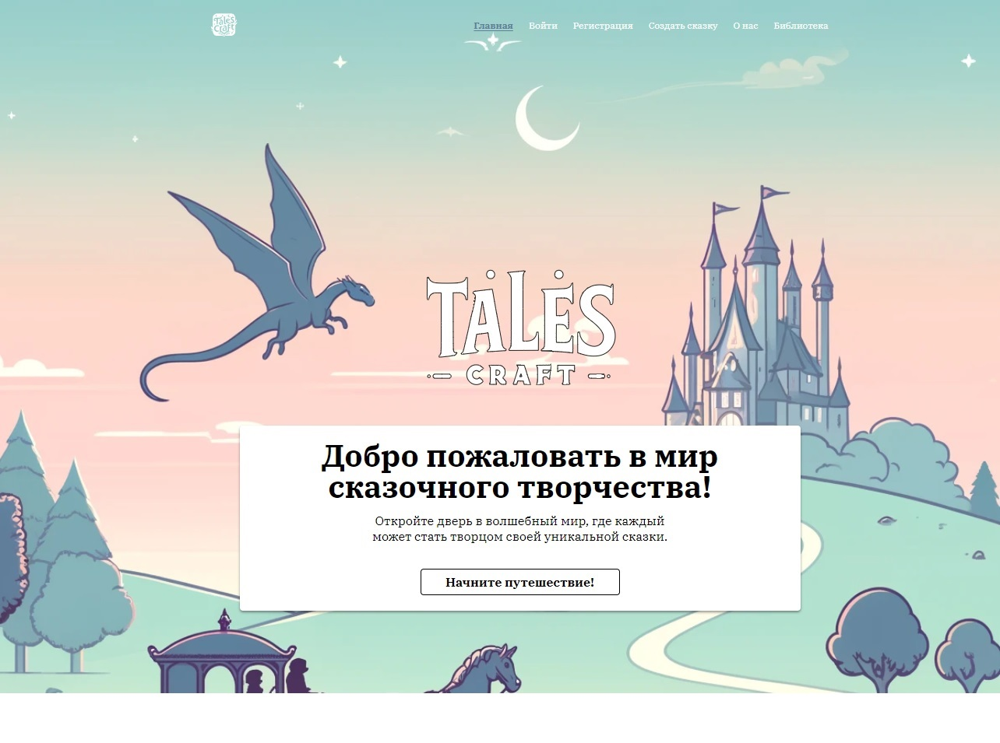
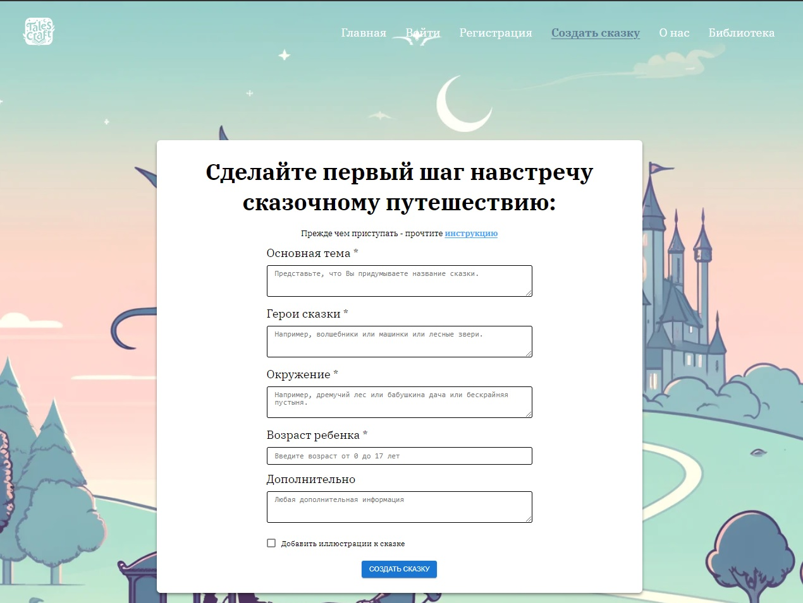
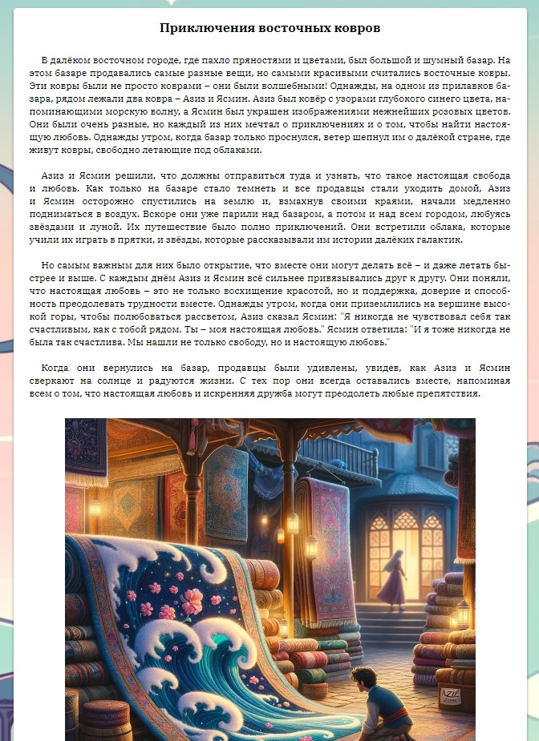

# Tales-Craft

Tales-Craft - это веб-приложение, созданное для генерации детских сказок с использованием API OpenAI. Приложение написано на TypeScript и использует библиотеку React для пользовательского интерфейса.

Посетите [Tales-Craft](https://tales-craft.ru/) для просмотра приложения в действии.

## Установка

Для запуска приложения локально выполните следующие шаги:

1. Убедитесь, что у вас установлен Node.js и npm.
2. Склонируйте репозиторий с помощью команды `git clone`.
3. Перейдите в каталог проекта и выполните `npm install` для установки зависимостей.
4. Запустите приложение с помощью `npm start`.
5. Откройте ваш браузер и перейдите по адресу `http://localhost:3000`.

## Использование

Tales-Craft предоставляет пользователю возможность создавать уникальные детские сказки. Для этого:

1. Перейдите на страницу "Создать сказку".
2. Заполните форму с указанием заголовка сказки, её содержания и, при необходимости, изображения.
3. Активируйте VPN на Вашем устройстве.
4. Нажмите кнопку "Создать", чтобы получить сгенерированную сказку.
5. При желании, вы можете сохранить сказку, чтобы просмотреть её позже в разделе "Библиотека".

## Функциональность

- Генерация уникальных детских сказок с помощью API OpenAI.
- Возможность сохранения сказок для последующего просмотра.
- Навигация между страницами с помощью роутинга React Router.
- Производительность: приложение достигает 70 баллов по метрике производительности Lighthouse.

## Технологии

- TypeScript
- React
- React Router
- OpenAI API
- SCSS

## Скриншоты

## Авторы

- Мастяев Алексей;

## Контакты

- **VK:** [vk.com/go6poeytpo](https://vk.com/go6poeytpo)
- **Яндекс:** [do6roeytro@yandex.ru](mailto:do6roeytro@yandex.ru)
- **GMail:** [warm.citrus@gmail.com](mailto:warm.citrus@gmail.com)
- **Telegram:** [t.me/Do6poeytpo](https://t.me/Do6poeytpo)